# 📐 Arquitectura, Flujos de Trabajo, Estados y Secuencias
## Sistema Bitácora de Campo Ganadera JA (PWA, Bot Telegram & Monitoreo Satelital)

Este documento presenta la especificación visual y técnica completa del sistema ganadero, integrando la arquitectura modular, los flujos operativos en campo, las máquinas de estado biológicas/operativas y los diagramas de secuencia de sincronización e inteligencia artificial.

---

## 🏛️ 1. Diagrama de Arquitectura Global del Sistema

El sistema opera bajo un modelo híbrido **Offline-First en el Edge** (PWA móvil para corral/manga) y **Cloud/VPS Central** (`206.189.188.183`), comunicando servicios zootécnicos, satelitales e inteligencia artificial con una base de datos SQLite en modo WAL (*Write-Ahead Logging*).

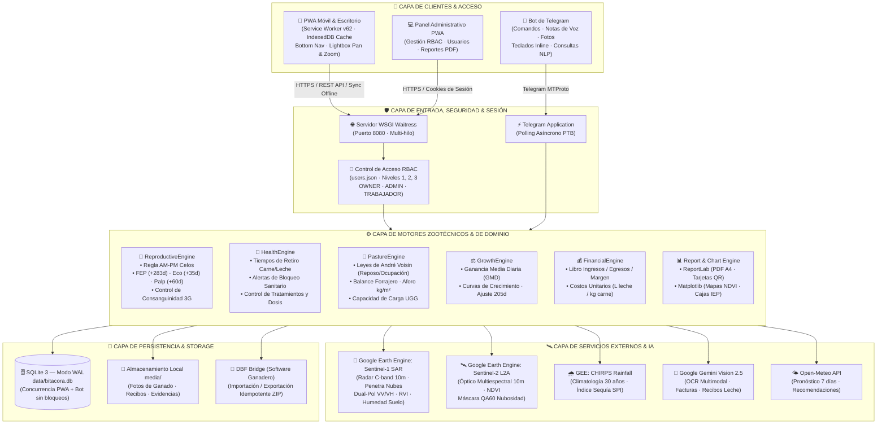

---

## 🔄 2. Flujos de Trabajo en Campo (Workflows)

### 2.1 Flujo de Pesaje y Manejo en Corral ("Modo Manga Offline")
Permite registrar pesajes individuales o por lotes directamente en el corral de manejo, calculando la Ganancia Media Diaria (GMD) en tiempo real sin requerir conectividad a Internet.

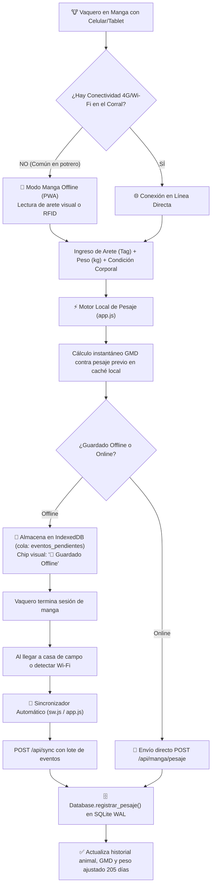

---

### 2.2 Flujo de Digitalización de Recibos y Gastos con IA Multimodal
Transforma recibos manuales de leche y facturas de insumos en registros contables automáticos, asociando la imagen como respaldo auditable.

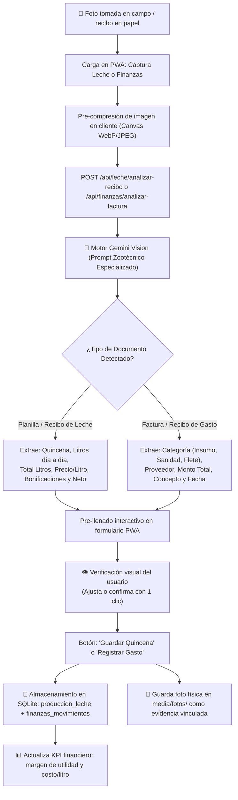

---

### 2.3 Flujo de Monitoreo Satelital Todo-Clima (Multi-Sensor SAR + Óptico)
Garantiza la supervisión continua del forraje los 365 días del año, superando la limitación de nubosidad tropical mediante microondas de radar.

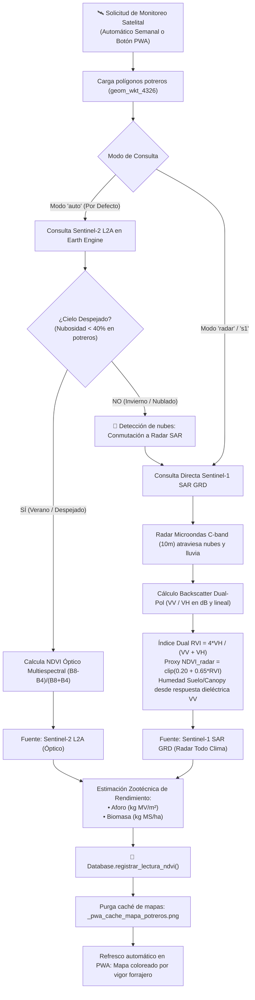

---

## 🚦 3. Máquinas de Estados (State Machines)

### 3.1 Ciclo de Vida del Animal en el Hato
Control estricto de inventario según la regla fundamental: **toda consulta de hato activo debe filtrar estrictamente por `estado = 'ACTIVO'`**.

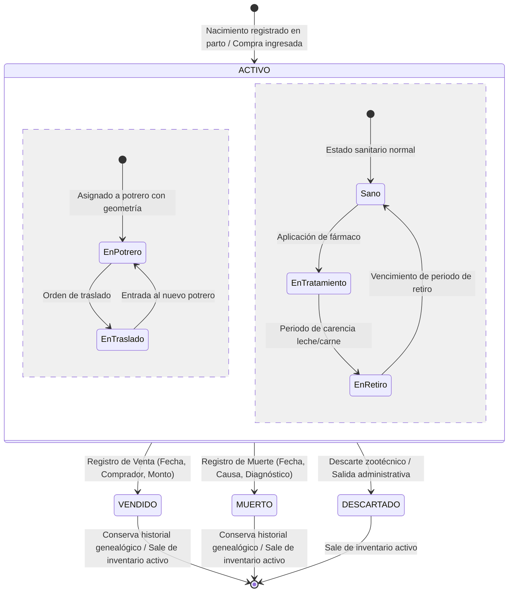

---

### 3.2 Ciclo Reproductivo de la Hembra Bovina
Gobierna la fertilidad del rebaño mediante la regla zootécnica AM-PM y el cronograma veterinario de confirmación de preñez.

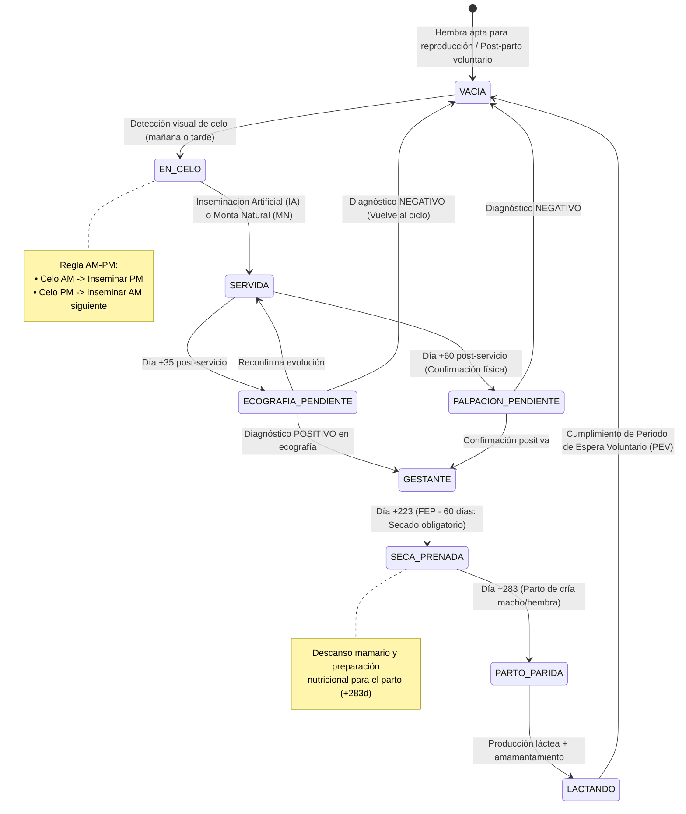

---

### 3.3 Semáforo de Ocupación y Rotación Voisin de Potreros
Implementa las leyes universales del pastoreo racional de André Voisin (ley del reposo y ley de la ocupación).

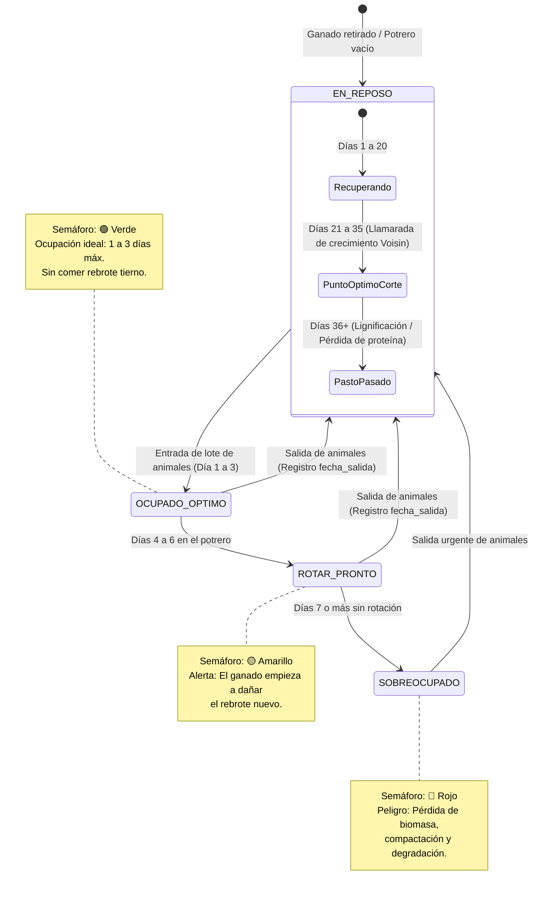

---

## ⏱️ 4. Diagramas de Secuencia (Sequence Diagrams)

### 4.1 Secuencia de Sincronización Offline Bidireccional (PWA ⇄ VPS)
Muestra cómo los datos capturados en mangas sin señal viajan con seguridad hasta la base de datos central sin pérdida de información.

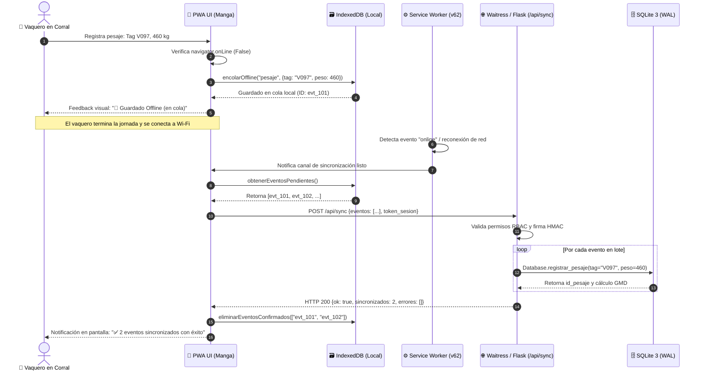

---

### 4.2 Secuencia de Digitalización de Facturas / Recibos con Gemini Vision
Flujo paso a paso para la extracción multimodal asistida por inteligencia artificial con supervisión humana.

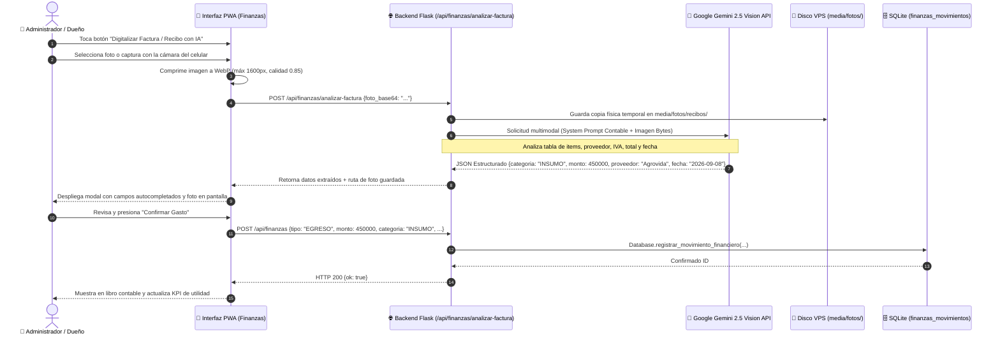

---

### 4.3 Secuencia del Monitoreo Satelital Radar SAR Sentinel-1
Detalla la invocación a Google Earth Engine desde el botón de la PWA para penetrar nubes y actualizar el mapa de potreros.

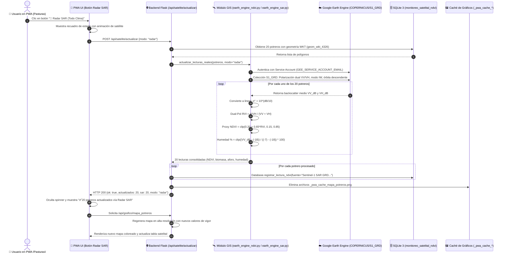

---

### 4.4 Secuencia del Despacho Matutino Diario (05:30 AM)
Orquesta el envío proactivo del informe diario matutino al canal de Telegram del propietario y personal de campo.

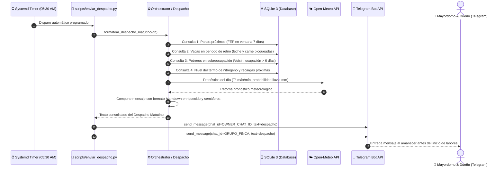

---

## 📋 Resumen de Componentes Clave

| Componente | Archivo / Ubicación | Responsabilidad Principal |
| :--- | :--- | :--- |
| **PWA Web App** | [`src/pwa/app.py`](file:///C:/Users/Owner/Documents/projects/finca/2026-08-24-bot-bitacora-de-campo/src/pwa/app.py) | Servidor WSGI Flask, API REST, autenticación RBAC y renderizado. |
| **PWA Client JS** | [`src/pwa/static/app.js`](file:///C:/Users/Owner/Documents/projects/finca/2026-08-24-bot-bitacora-de-campo/src/pwa/static/app.js) | Lógica de vistas, IndexedDB offline, visor Pan/Zoom y sincro de eventos. |
| **Service Worker** | [`src/pwa/static/sw.js`](file:///C:/Users/Owner/Documents/projects/finca/2026-08-24-bot-bitacora-de-campo/src/pwa/static/sw.js) | Caché de activos estáticos, interceptor offline e instalación en móviles. |
| **Telegram Bot** | [`src/server/telegram_bot.py`](file:///C:/Users/Owner/Documents/projects/finca/2026-08-24-bot-bitacora-de-campo/src/server/telegram_bot.py) | Interfaz de mensajería, comandos de audio, fotos y despacho diario. |
| **Base de Datos** | [`src/db/database.py`](file:///C:/Users/Owner/Documents/projects/finca/2026-08-24-bot-bitacora-de-campo/src/db/database.py) | Capa de persistencia SQLite 3 en modo WAL, reglas de hato activo. |
| **Sentinel-1 SAR** | [`src/gis/earth_engine_sar.py`](file:///C:/Users/Owner/Documents/projects/finca/2026-08-24-bot-bitacora-de-campo/src/gis/earth_engine_sar.py) | Monitoreo radar microondas C-band todo clima, biomasa RVI y humedad. |
| **Sentinel-2 NDVI** | [`src/gis/earth_engine_ndvi.py`](file:///C:/Users/Owner/Documents/projects/finca/2026-08-24-bot-bitacora-de-campo/src/gis/earth_engine_ndvi.py) | Monitoreo multiespectral óptico y fallback automático a SAR en nubes. |
| **IA Multimodal** | [`src/vision/recibo_leche_parser.py`](file:///C:/Users/Owner/Documents/projects/finca/2026-08-24-bot-bitacora-de-campo/src/vision/recibo_leche_parser.py) | Digitalización inteligente con Google Gemini Vision para recibos y facturas. |
| **Generador Mapas** | [`src/engine/charts.py`](file:///C:/Users/Owner/Documents/projects/finca/2026-08-24-bot-bitacora-de-campo/src/engine/charts.py) | Cartografía vectorial de potreros reales con proyección esférica corregida. |
| **Reportes PDF** | [`src/reports/pdf_report.py`](file:///C:/Users/Owner/Documents/projects/finca/2026-08-24-bot-bitacora-de-campo/src/reports/pdf_report.py) | Generación ejecutiva ReportLab de fichas técnicas y reportes generales. |


---

## 📷 4. Flujo de Gestión de Fotos de Campo + OCR (Fase 3.2)

1. **Recepción:** El usuario envía una foto (con o sin caption) por Telegram o CLI `--imagen`.
2. **OCR (`src/ocr/ocr_engine.py`):** `OCREngine` intenta extraer texto de la imagen con backend `pytesseract` + `Pillow` (o `easyocr` secundario). Si no hay dependencias, usa fallback `sidecar .txt` (útil en tests) y degradación graceful sin tumbar el bot. `detect_tags()` reconoce `N069`, `N-069`, `JA26`, `O-123`, `47`, `patricia`; `detect_medicamento()` extrae producto, dosis (`ml/kg`), vía (`IM/SC/IV/Oral`), lote y `dias_retiro`.
3. **Identificación:** Si el caption **o** el texto OCR incluye el arete (ej. `vaca 47 ubre inflamada` o arete visible en foto), se asocia automáticamente a la `47`. Si el OCR detecta frasco/medicamento, se dispara también el parser de tratamiento. Feedback contextual: `🔍 OCR detectó tag N069` / `💊 OCR detectó medicamento: Oxitetraciclina`.
4. **Persistencia:** La foto se almacena en `media/` y su metadata (`ruta`, `tag`, `caption`, `ocr_text`, `user_id`, `fecha`) en la tabla `fotos` de SQLite (migración idempotente `ocr_text TEXT` vía `ALTER TABLE`).
5. **Consulta:** 
   - Vía Telegram: `/fotos 47` o `/fotos` envía directamente las imágenes con sus captions, ocr_text y fechas.
   - Vía Lenguaje Natural: `¿hay fotos de la 47?` responde con la cantidad y disponibilidad de fotos registradas.
   - Vía Historial: `/historial 47` incluye el conteo de fotos en la ficha del animal.

### 4.1 Ficha Zootécnica y `/status` (GANADERIA-JA 01-JA)

- **Edad humana** (`formatear_edad_zootecnica` en `src/engine/query_engine.py`): `🎂 Edad: 7 años 3 meses (2.667 días)` / `8 meses (243 días)` / `12 días`, inferida desde `animales.fecha_nacimiento` o `partos.fecha` de la madre (<450d). Visible en header de `/historial`.
- **Estados SG fieles**: `CRÍA MACHO (<8m)`, `LEVANTE (8-18m)`, `TORETE (18-30m)`, `TORO (>30m)` / `CRÍA HEMBRA`, `NOVILLA LEVANTE (12-18m)`, `NOVILLA VIENTRE (≥18m)`, `VACA PARIDA (≤305d)` vs `VACA SECA/ESCOTERA (>305d)`. Partos/días abiertos solo para hembras; partos autorreferenciados (`vaca_id == id_cria`) se excluyen y se bloquean para machos.
- **`/status` filtrado por finca**: `Activos: 338 (GANADERIA-JA 01-JA)` sin `Histórico`; `Potrero + reposo` ignora reposos absurdos `>365d` (ej. JARA 3.232d histórico) y `Potrero + animales` cuenta solo `estado='ACTIVO'` por último traslado; `Actualizado` usa `mtime` de `data/bitacora.db` (fecha del último backup SG) con fallback a `MAX(partos.fecha)`.

### 4.2 Modelo de Datos Extendido & Hardening Concurrente (WAL)

La base de datos SQLite opera con parámetros de concurrencia y confiabilidad para alta carga:
- **Modo WAL (`PRAGMA journal_mode=WAL`):** Permite lecturas y escrituras simultáneas sin bloqueos mutuos entre los procesos del Bot de Telegram, los observadores de backups y las tareas programadas.
- **Tolerancia a Bloqueos (`PRAGMA busy_timeout=10000`):** Espera hasta 10 segundos antes de fallar por contención de base de datos.
- **Integridad Referencial (`PRAGMA foreign_keys=ON`):** Asegura consistencia relacional.

**Tablas Nuevas Integradas:**
- `produccion_leche`: Registra pesajes individuales de leche vinculados a `animal_id`, o registros de producción total diaria del hato en el tanque (`animal_id = NULL`).
- `recordatorios_programados`: Tareas de campo agendadas con `mensaje`, `fecha_programada`, `hora`, `creado_por`, `estado` (`PENDIENTE`/`ENVIADO`) y `creado_en`.

**Índices Compuestos de Rendimiento:**
- `idx_recordatorios_fecha_estado` en `recordatorios_programados(fecha_programada, estado)`
- `idx_animales_tag` en `animales(tag)` y `idx_animales_estado` en `animales(estado)`
- `idx_animales_potrero` en `animales(potrero_id)`
- `idx_partos_vaca_fecha` en `partos(vaca_id, fecha)` e `idx_partos_cria` en `partos(id_cria)`
- `idx_servicios_vaca_fecha` en `servicios(vaca_id, fecha)`
- `idx_celos_vaca_fecha` en `celos(vaca_id, fecha)`
- `idx_tratamientos_animal_fecha` en `tratamientos(animal_id, fecha)`
- `idx_traslados_animal_fecha` en `traslados(animal_id, fecha)`
- `idx_pesajes_animal_fecha` en `pesajes(animal_id, fecha)`
- `idx_movimientos_animal_fecha` en `movimientos(animal_id, fecha)`
- `idx_fotos_animal_tag` en `fotos(animal_id, tag)`

---

---

## 🤖 5. Arquitectura NLU Híbrida Multi-Agente (Gemini)

El parser implementa dos capas para maximizar velocidad y comprensión de jerga de campo:

| Capa | Motor | Cuándo se activa | Latencia | Dependencias |
|------|:-----:|---|:---:|---|
| **Capa 1** | Regex local (`src/parsers/nlp_engine.py`) | Siempre (intento rápido) | <1 ms | Ninguna |
| **Capa 2** | Multi-agente Gemini (`src/llm/orchestrator.py`) | Texto sin intención conocida, >20 palabras, o múltiples eventos ("y también vacune...") | 800–3000 ms | `GEMINI_API_KEY` configurada |

**Capa 2 — arquitectura multi-agente:**
1. **Router determinista** (`src/llm/router.py`, sin llamada LLM): agrupa los 8 tipos de evento en 3 dominios — `reproduccion` (parto, servicio, celo), `sanidad` (tratamiento, muerte), `manejo` (pesaje, traslado, movimiento) — escaneando los mismos patrones de `nlu.INTENTOS` que usa la Capa 1.
2. Si detecta **1 dominio** → 1 llamada al extractor de ese dominio (`reproduccion.py` / `sanidad.py` / `manejo.py`).
3. Si detecta **≥2 dominios** → llamadas EN PARALELO (`ThreadPoolExecutor`) a cada extractor implicado; resultados combinados preservando el orden de dominios (determinista, no depende de cuál responda primero por red).
4. Si **no detecta ningún dominio** → 1 llamada al **Agente Clasificador** (`src/llm/clasificador.py`), que devuelve los dominios aplicables, y luego se invoca a los extractores correspondientes.
5. Cada extractor de dominio usa `generationConfig.responseSchema` + `responseMimeType: application/json` para garantizar salida JSON conforme al schema (`src/llm/schemas.py`) — ya no hace falta parseo manual de markdown/JSON embebido en texto libre.

- **Endpoint:** `https://generativelanguage.googleapis.com/v1beta/models/{model}:generateContent`
- **Modelo por defecto:** `gemini-2.5-flash` (configurable vía `GEMINI_MODEL`)
- **Variables:** `GEMINI_API_KEY` y `GEMINI_MODEL` en `.env`
- **Validación:** normalización determinista (no LLM) por dominio — sexo_cria/estado_cria/tipo_servicio/am_pm en `reproduccion.py`, retiro leche/carne en `sanidad.py`, peso_kg/cantidad en `manejo.py`.
- **Fallback:** Si no hay API key (o placeholder), timeout, error HTTP/URLError, o fallo de un dominio en la ejecución paralela → retorno silencioso a Capa 1 sin tumbar el bot (en fallo parcial, se conservan los eventos de los dominios que sí respondieron). Logging en `bitacora.llm` sin exponer la key.
- **Integración:** `EventParser.parse()` retorna `ParsedEvent | list[ParsedEvent]`; `Bot.procesar_texto()` itera y persiste cada evento con sus alertas (`src/bot/bot_interface.py`) — sin cambios en este contrato.

```text
Texto "parió la 47 y vacune la 12 con 20ml"
        │
        ▼
  EventParser._should_try_llm()? --sí--> try_multiagent_parse()
        │                                   │
        │                          router.dominios_detectados()
        │                                   │
        │                    {"reproduccion", "sanidad"} (2 dominios)
        │                                   │
        │                     ┌─────────────┴─────────────┐
        │                     ▼ (paralelo)                 ▼ (paralelo)
        │              reproduccion.parse()          sanidad.parse()
        │                  [parto 47]                [tratamiento 12]
        │                     └─────────────┬─────────────┘
        │                                   ▼
        │                        combinar → [parto 47, tratamiento 12]
        │                                   │ fallo/timeout/sin key
        │                                   └──────────► fallback
        ▼
     regex local (capa 1)
```

---

## 🛡️ 6. Matriz de Roles y Permisos (RBAC)

| Comando / Recurso | 👑 OWNER | 🛠️ ADMIN | 📋 TRABAJADOR |
|---|:---:|:---:|:---:|
| `/start`, `/help`, `/menu` | ✅ | ✅ | ✅ |
| `/despacho`, `/matutino`, `/hoy` | ✅ | ✅ | ✅ |
| `/leche <litros>` | ✅ | ✅ | ✅ |
| `/programar <fecha> <hora> <msg>` | ✅ | ✅ | ✅ |
| Registro de 8 eventos (texto) | ✅ | ✅ | ✅ |
| Notas de voz / Fotos de campo | ✅ | ✅ | ✅ |
| Consultas lenguaje natural | ✅ | ✅ | ✅ |
| `/fotos [tag]` | ✅ | ✅ | ✅ |
| `/alertas` | ✅ | ✅ | ❌ |
| `/historial <tag>` | ✅ | ✅ | ❌ |
| `/graficos` | ✅ | ✅ | ❌ |
| `/potreros` | ✅ | ✅ | ❌ |
| `/animales` | ✅ | ✅ | ❌ |
| `/status` | ✅ | ✅ | ❌ |
| `/usuarios` | ✅ | ✅ | ❌ |
| `/reporte [diario\|semanal\|N]` | ✅ | ✅ | ❌ |
| `/exportar [dbf\|csv\|json]` (solo OWNER, avisa a los demás OWNER) | ✅ | ❌ | ❌ |
| `/importar`, `/confirmar_importar` | ✅ | ✅ | ❌ |
| `/agregar_usuario`, `/quitar_usuario` | ✅ | ❌ | ❌ |
| `/logs` | ✅ | ❌ | ❌ |
